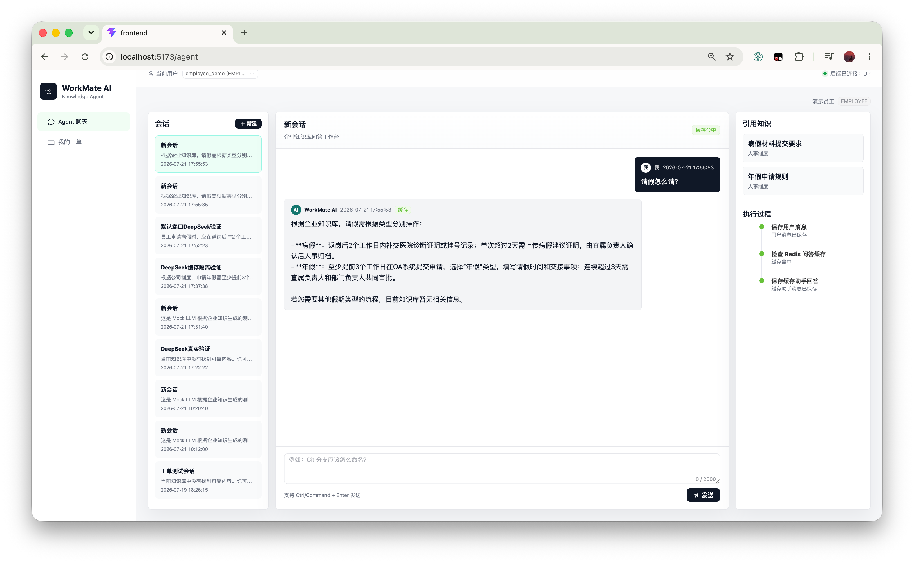
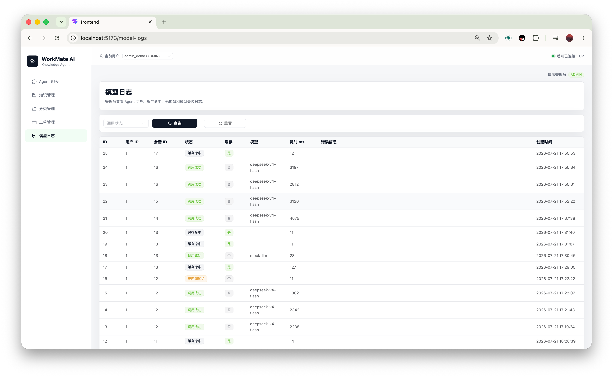
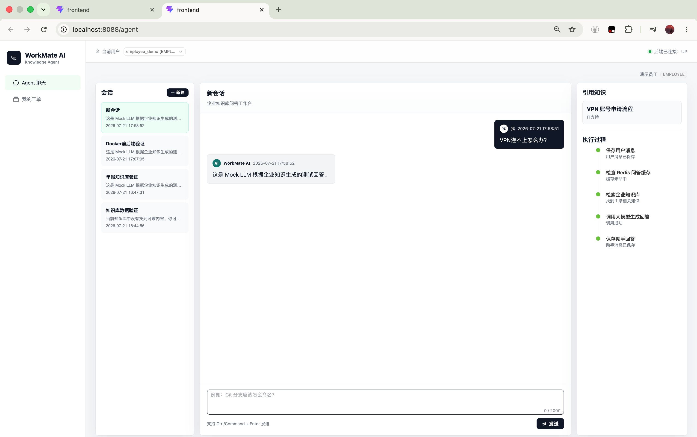

# WorkMate AI

WorkMate AI 是一个企业内部知识库问答 Agent MVP。系统优先检索企业知识库，再调用 LLM 基于知识生成回答；如果知识库没有可靠内容，则不让模型自由发挥，而是引导用户创建人工工单。

## 功能

- Agent 聊天：Redis 缓存、MySQL 知识检索、LLM 回答、引用知识展示。
- 知识管理：分类、知识新增/编辑、启停和逻辑删除。
- 工单管理：员工创建工单，管理员处理工单。
- 模型日志：记录调用状态、模型名、耗时、缓存命中和 token 信息。
- Docker 部署：MySQL、Redis、后端、前端 Nginx 一键启动。

## 技术栈

- 后端：Java 17、Spring Boot 3、MyBatis-Plus、MySQL 8、Redis、Maven。
- 前端：Vue 3、TypeScript、Vite、Element Plus、Axios。
- 部署：Docker、Docker Compose、Nginx。
- LLM：Mock LLM、DeepSeek API。

## 截图

### 本地 DeepSeek 回答



### DeepSeek 模型日志



### Docker Mock 闭环



## 本地运行

复制本地配置文件：

```bash
cp .env.example .env
```

本地默认使用 DeepSeek。在 `.env` 中填写你的 DeepSeek API Key：

```dotenv
WORKMATE_LLM_PROVIDER=deepseek
WORKMATE_LLM_MODEL=deepseek-v4-flash
DEEPSEEK_BASE_URL=https://api.deepseek.com
DEEPSEEK_API_KEY=your_local_key
```

启动后端：

```bash
cd backend
mvn spring-boot:run
```

启动前端：

```bash
cd frontend
npm install
npm run dev
```

默认访问：

```text
http://localhost:5173
```

后端默认端口是 `8080`，前端默认端口是 `5173`。后端会读取项目根目录 `.env`。

## Docker 部署

Docker 默认使用 Mock LLM，适合无密钥演示和部署验证：

```bash
cp .env.example .env
./scripts/docker-up.sh
```

如果需要让 Docker 也使用 DeepSeek，请只在本机 `.env` 中设置 Docker 专用变量：

```dotenv
DOCKER_WORKMATE_LLM_PROVIDER=deepseek
DOCKER_WORKMATE_LLM_MODEL=deepseek-v4-flash
DOCKER_DEEPSEEK_BASE_URL=https://api.deepseek.com
DOCKER_DEEPSEEK_API_KEY=your_local_key
```

更详细部署说明见 [deploy/README.md](deploy/README.md)。

## 演示用户

- 员工：`employee_demo`，请求头 `X-User-Id: 1`
- 管理员：`admin_demo`，请求头 `X-User-Id: 2`

前端通过顶部用户选择器切换演示用户。
